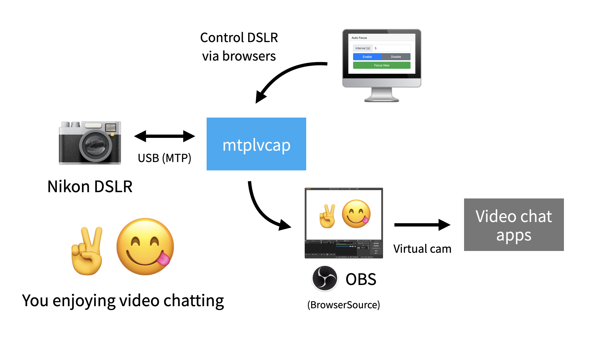
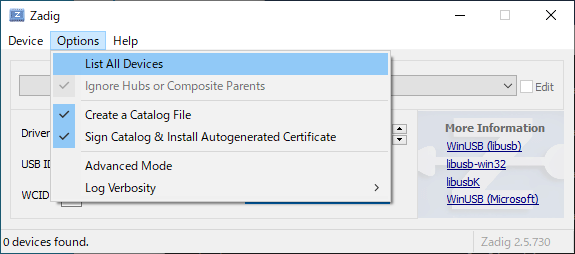
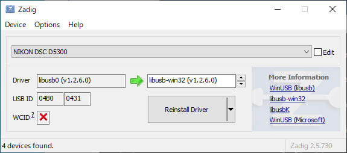
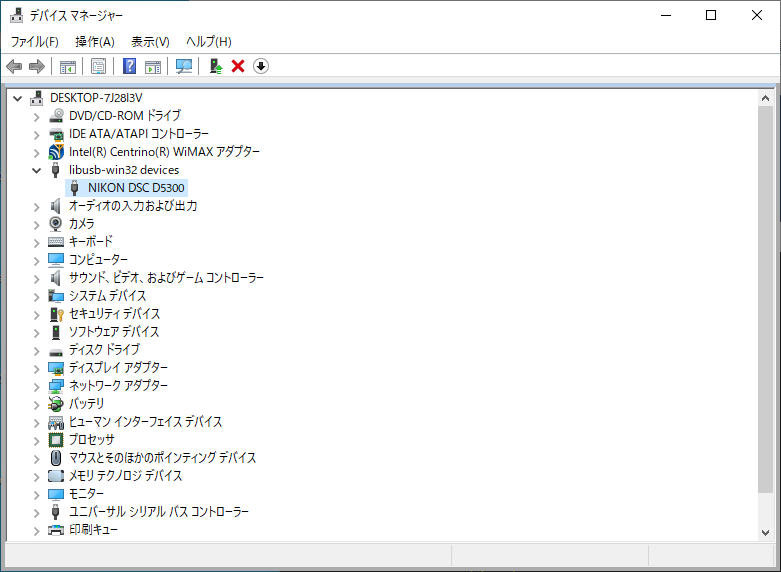
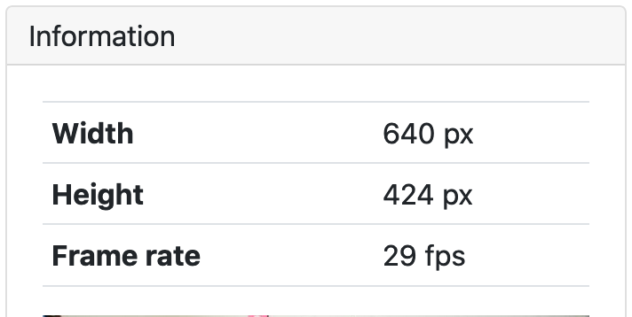
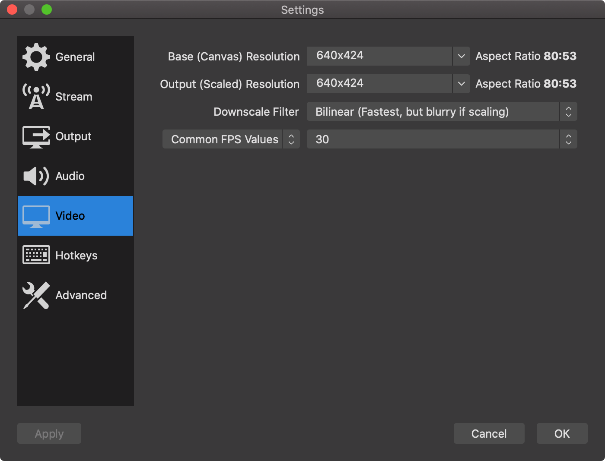
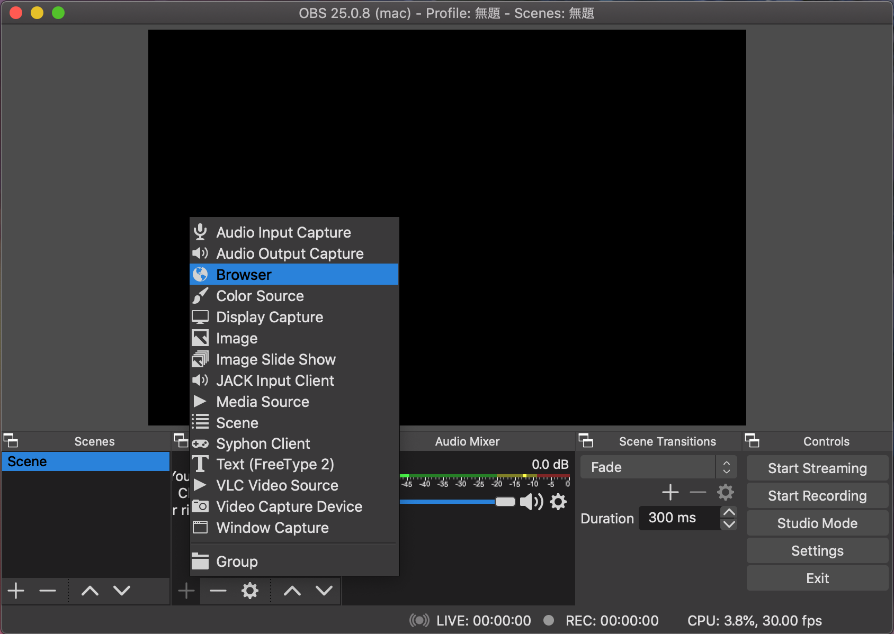
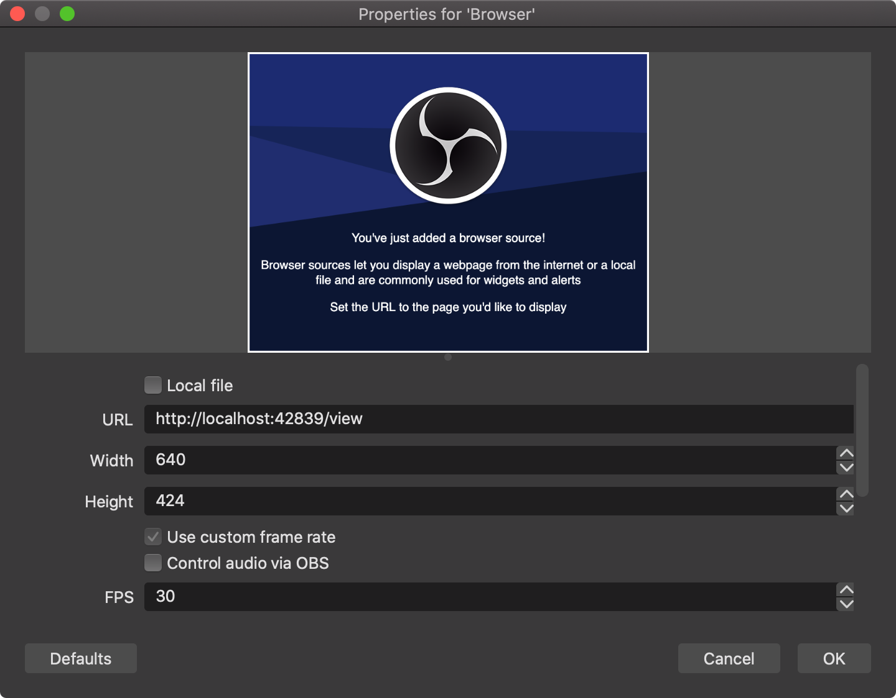
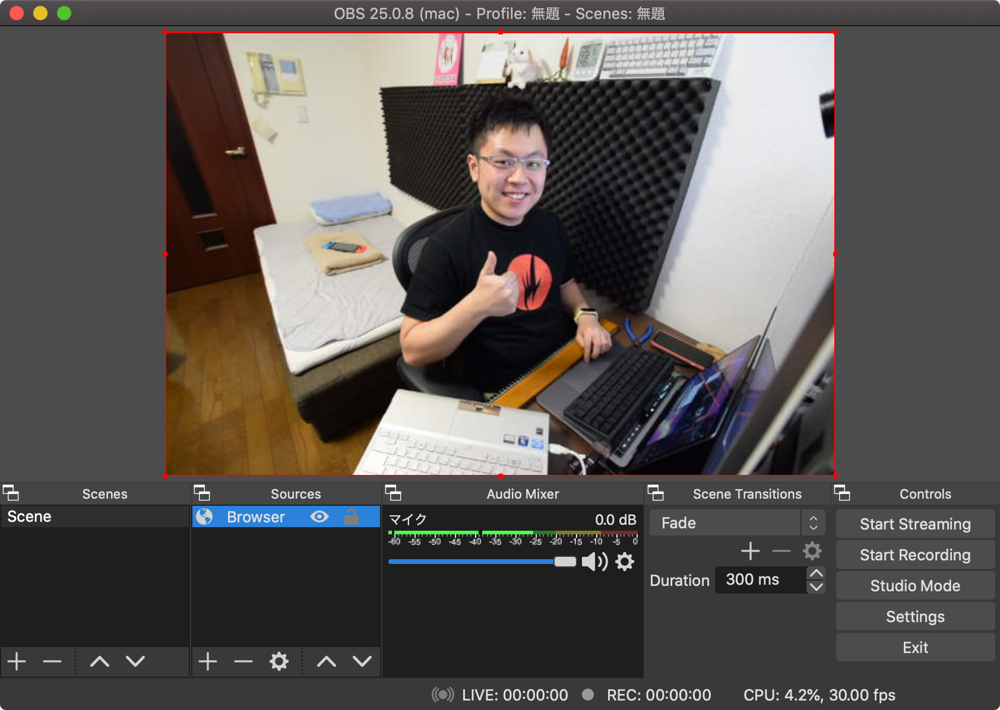
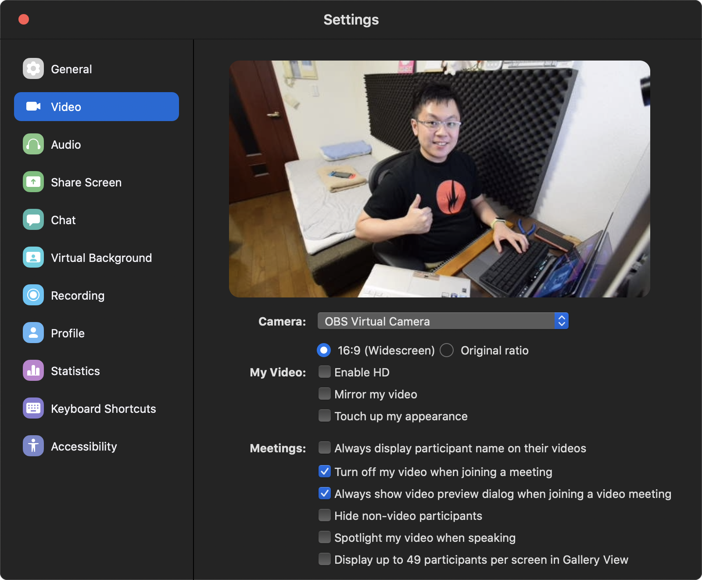

## Introduction



mtplvcapは、NikonのカメラのLive ViewをWebSocketでブラウザにリレーするマルチプラットフォーム対応 (Windows, Mac, Linux) のソフトです。

mtplvcapとOBSを組み合わせることで、NikonのカメラをWebカメラにできます。お気に入りのカメラでGoogle Hangouts・Meet・Zoomを楽しみましょう！


## 動作を確認しているもの

カメラ:
 - Nikon D5300
 - フィードバック歓迎！お手持ちのカメラの動作可否を是非Issueにあげてください。

OS:
 - Windows 10 version 1909, OS build 18363.900, MSYS2 (MinGW x86_64), amd64
 - macOS 10.15.5 Catalina, amd64
 - Debian GNU/Linux 10 Buster, amd64


## インストール方法

注釈: このセクションにあるShellのコードスニペットは全部コピペできます。


### Windows

**重要！ Windowsでは、カメラを接続すると自動でインストールされるMTPドライバをlibusbの汎用ドライバと置き換える必要があります。
置き換えると、手動でドライバを指定し直さない限りカメラはMTPデバイスとして認識されなくなります。以上を認識の上で続行してください。**


#### 1. 一眼レフのドライバを置き換える

1. カメラをPCに接続します
1. Zadigを[ここ](https://zadig.akeo.ie/)からダウンロードして開きます
1. `List All Devices` にチェックを入れます

    

1. 画面上のリストにカメラ名があるのを確認し、選択します

    

    （このスクショは置き換え後に撮ったものなので、ボタンの表記が "Reinstall Driver" となっていますが気にしないでください）

1. 中央下の選択ボックスで `libusb-win32 (vX.X.X.X)` を選択します
    - 最初は `WinUSB` が選択されているはずですが動作しないので注意してください

1. `Replace Driver` ボタンを押して完了するまで待ちます
    - デバイスマネージャーを起動して確認してみてください

    


#### 2a. ビルド済みの実行ファイルを使う

1. Windows用の実行ファイル (mtplvcap-xxxxxxx-windows-amd64.zip) を[ここ](https://github.com/puhitaku/mtplvcap/releases)からダウンロードします
1. ZIPをダブルクリックして展開します
1. `mtplvcap.exe` をダブルクリックして実行します
    - カメラのシャッターが開くのを確認してください


#### 2b. MSYS2で手でビルドする

1. MSYS2を[ここ](https://www.msys2.org/)からダウンロードしてインストールします
1. スタートメニューから "MSYS2 MSYS" を実行します
1. 依存するパッケージをインストールします

    ```sh
    pacman -Sy mingw-w64-x86_64-toolchain \
               mingw-w64-x86_64-libusb \
               mingw-w64-x86_64-go \
               mingw-x64-x86_64-pkg-config \
               git
    ```

1. PATHを追加します

    ```sh
    echo 'PATH=$PATH:/mingw64/bin:/mingw64/lib/go/bin' >> ~/.bashrc
    source ~/.bashrc
    ```

1. このリポジトリをクローンします

    ```sh
    git clone https://github.com/puhitaku/mtplvcap.git
    ```

1. `cd`してビルドして起動します

    ```sh
    cd mtplvcap
    CGO_CFLAGS='-Wno-deprecated-declarations' go build .
    ./mtplvcap.exe -debug server
    ```

    - カメラのシャッターが開くのを確認してください

1. ゴール！
    - ビルドされたバイナリは移動したり再配布することが可能です
    - `C:\msys64\mingw64\bin\libusb-1.0.dll` から `libusb-1.0.dll` を `mtplvcap.exe` と同じディレクトリにコピーしてくればどこでも起動できます


### macOS

#### 1. 依存パッケージをインストールする
1. [Homebrew](https://brew.sh/)をインストールします

1. libusbをインストールします

    ```sh
    brew install libusb
    ```


#### 2a. ビルド済みの実行ファイルを使う

1. Windows用の実行ファイル (mtplvcap-xxxxxxx-windows-amd64.zip) を[ここ](https://github.com/puhitaku/mtplvcap/releases)からダウンロードします
1. ZIPを展開して起動します

    ```sh
    unzip mtplvcap-*.zip
    ./mtplvcap
    ```

    - カメラのシャッターが開くのを確認してください


#### 2b. 手でビルドする

1. 依存パッケージをインストールします

    ```sh
    brew install golang git
    ```

1. XCode Command Line Toolsをインストールします

    ```sh
    xcode-select --install
    ```

1. このリポジトリをクローンします

    ```sh
    git clone https://github.com/puhitaku/mtplvcap.git
    ```

1. `cd`してビルドして起動します

    ```sh
    cd mtplvcap
    CGO_CFLAGS='-Wno-deprecated-declarations' go build .
    ./mtplvcap -debug server
    ```

    - カメラのシャッターが開くのを確認してください

1. ゴール！


#### Linux (e.g. Ubuntu/Debian)

Linuxはディストリによって環境が大きく異なるためビルド済みバイナリは用意していません。

1. 依存パッケージをインストールします

    ```sh
    sudo apt install golang-go libusb-1.0.0-dev
    ```

1. `cd`してビルドして起動します

    ```sh
    cd mtplvcap
    CGO_CFLAGS='-Wno-deprecated-declarations' go build .
    ./mtplvcap -debug server
    ```

    - カメラのシャッターが開くのを確認してください


### 使い方

```sh
$ ./mtplvcap -help
Usage of ./mtplvcap:
  -backend-go
        force gousb as libusb wrapper (not recommended)
  -debug string
        comma-separated list of debugging options: usb, data, mtp, server
  -host string
        hostname: default = localhost, specify 0.0.0.0 for public access (default "localhost")
  -port int
        port: default = 42839 (default 42839)
  -product-id string
        PID of the camera to search (in hex), default=0x0 (all) (default "0x0")
  -server-only
        serve frontend without opening a DSLR (for devevelopment)
  -vendor-id string
        VID of the camera to search (in hex), default=0x0 (all) (default "0x0")
```


#### 撮られている映像を見る

 - `http://localhost:42839/view` を開くとキャプチャされたフレームが見えます


#### ブラウザでカメラを制御する

 - `http://localhost:42839` を開くとカメラを制御するコントローラーが使えます
 - "Auto Focus" セクションは定期的もしくは手動でAFを動作させられます
 - "Rate Limit" セクションはフレームレートの上限を設定でき、CPU消費量の削減に使えます
 - "Information" セクションはキャプチャされているフレームの大きさ、FPS、プレビューが見えます


#### Zoom, Google Meet, Google Hangoutsなどとつなぐ

1. mtplvcapをインストールし、動作することを確認します

1. OBS (Open Broadcaster Software) を[ここ](https://obsproject.com/)からインストールします

1. OBSバーチャルカメラをインストールします（OSにより異なります; ググってください）

1. OBSの設定を開き「映像」タブを開きます

1. Live Viewの画像サイズとぴったり合うように映像サイズを設定します
    - mtplvcapを起動して `localhost:42839` を開くと「Information」セクションにサイズが載っています

    
    

1. 「ブラウザ」ソースを追加します

    

1. 「幅」と「高さ」の値を「映像」タブの設定と同じ値に設定します

1. URLを `http://localhost:42839/view` に設定します

    

1. バーチャルカメラをONにしてチャットアプリを設定します

1. キター！！！

    
    


### 諸注意・既知の問題

 - このソフトはアルファ版です
 - 全環境共通: シャッターが勝手に閉まって開く
    - カメラ内部のタイムアウト的なのが絡んでそうです
    - 現状では、閉まっていたら開けるというワークアラウンドで対処しています
 - Windowsのみ: MinTTY（MSYS2付属のターミナルエミュレータ）でmtplvcapを動かしている時、Ctrl-Cで終了すると終了処理が行われずに突然Killされる
    - 終了処理が行われないので、次の起動時に初期化に失敗したり、ケーブルの抜き差しが必要になったりします
    - これはMinTTYおよびでは知られた動作であり、mtplvcapのバグではありません
    - winptyをpacmanでインストールして、それ経由で起動すると解決します: `pacman -Sy winpty && winpty ./mtplvcap`
    - Explorerから直接mtplvcapを起動するのは問題ありません、ただしバツボタンではなく必ずCtrl-Cで終了してください


### フィードバック

 - IssueもPRも大歓迎です。[CONTRIBUTING.md](./CONTRIBUTING.md)に従って提出してください。
 - D5300以外では動作確認できていません。是非お手持ちのカメラが動作したかどうかレポートしてください。


### Special Thanks

このプログラムは[github.com/hanwen/go-mtpfs](https://github.com/hanwen/go-mtpfs)からForkして大改造したものです。
go-mtpfsの堅牢で安定したMTP実装がなければ、mtplvcapは実現まではるかに遠かったはずです。Han-Wenさん本当にありがとうございます！


### ライセンス

[LICENSEファイルはこちら](./LICENSE)
